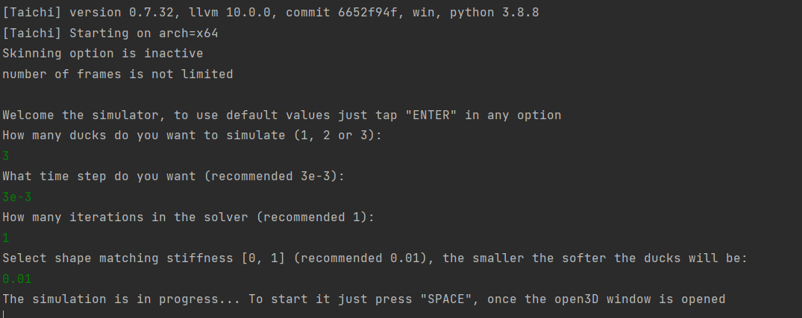
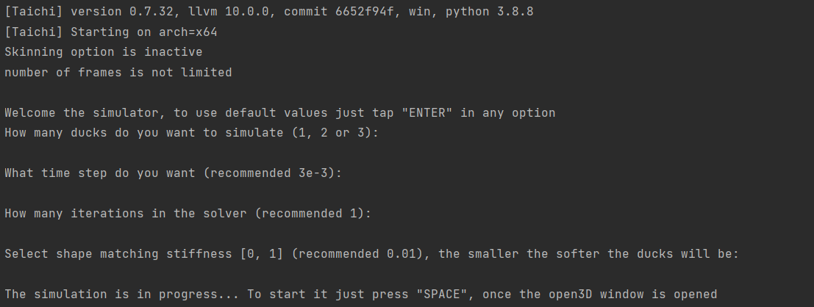
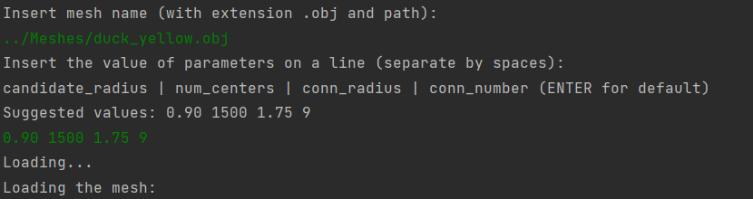
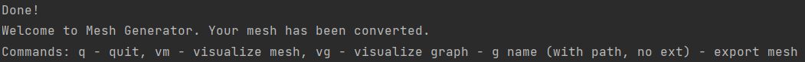

# Physics Simulation with Oriented Particles

## Overview
Simulation of soft and rigid bodies, and their collisions using a graph of oriented particles. This is an implementation in [Taichi](https://taichi.graphics/) of the paper [Solid Simulation with Oriented Particles](https://matthias-research.github.io/pages/publications/orientedParticles.pdf) by Matthias Muller and Nuttapong Chentanez.

🏅 The project was awarded a prize by researchers at Disney Research Studios and professors from ETH Zurich.

| https://github.com/Toratom/PBS_Project/assets/74663696/1af0cdf2-ca73-4acd-a20c-02c6d91d8644 | 
|:--:| 
| *Simulation visualization and rendering of soft and rigid ducks collisions* |

https://github.com/Toratom/PBS_Project/assets/74663696/1af0cdf2-ca73-4acd-a20c-02c6d91d8644

## Version of the libraries used
Taichi - 0.7.32 </br>
Numpy - 1.21.2 </br>
Sklearn - 1.0 </br>
Tqdm - 4.62.3 </br>
Open3d - 0.13.0 </br>
Scipy - 1.7.1 </br>
Our python version: Python 3.8

## How to run the code

### main.py (in folder Simulator)
**Has to be run from the folder ```PBS_Project/Simulator```.** <br/>
```main.py``` represents our simulator. We have prepared a mock simulation
to simplify the imports of meshes and the set-up of the program.<br/>
```main.py``` can be runned in smulation mode or skinning mode.<br/>
To run in simulation mode, no arguments are required:
```
.../PBS_Project/Simulator> python3 main.py
```
To run in skinning mode, two parameters are required:
```
.../PBS_Project/Simulator> python3 main.py True [num_frames]
```
Where "True" indicates that the skinning is active, while num_frames
is the number of frames produced. These frames can be rendered in any 3d
program. We used Blender.<br/>
For example, to produce the whole animation:
```
python3 main.py True 2005
```
A sample execution is the following:

If we want to use default parameters:


### mesh_generator.py (in folder MeshGenerator)
```mesh_generator.py``` allows to build custom particles graphs that can be
used in the simulator. In the folder ```PBS_Project/Meshes```, we have prepared a duck
mesh that can be used as a test. The programme does not require any
parameter.
```
.../PBS_Project/MeshGenerator> python3 mesh_generator.py
```
During the execution, a CLI will be used to set up some parameters.
These parameters are needed to process meshes of different shapes,
and sizes. Our suggestion is to use the duck mesh with the parameters
"0.90 1500 1.75 9".
A sample execution is the following:


We implemented several commands to interact with the generated mesh
```
q  # Exit from the script
```
```
vm  # Visualize the loaded mesh
```
```
vg  # Visualize the generated graph
```
```
g Meshes/graph_name  # Create graph_name.pkl in the folder Meshes
```
Note: we use .pkl files to store the data of the particles graphs

## Contributors
[Davide Corigliano](https://github.com/daviC1999) - [Lucas Teissier](https://github.com/LucasTsr) - [Thomas Poyet](https://github.com/Toratom)
